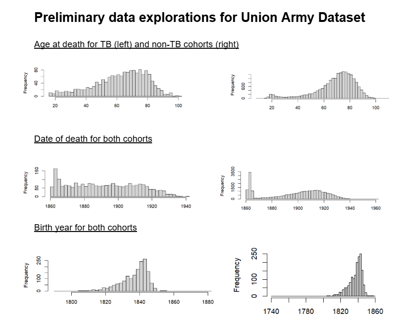

# Union Army Dataset
Analyzing Long-Term Effects of Tuberculosis (TB) Before Treatment Using Union Army Soldiers
* What are the survival rates for TB-affected soldiers compared to other soldiers?
* What are the differences in enlistment and hospitilization timelines between the two cohorts? 

### Repo Structure
- `scripts/` — data exploration and preprocessing
- `analysis/` — R Markdown analyses and modeling
- `data/` — raw and processed datasets (not tracked)

## At-a-Glance

| Feature | Details |
|---------|---------|
| **Data** | ~40,000 individual records (demographics, health markers, dates, outcomes) |
| **Methods** | Data cleaning, merging, and standardization; exploratory visualization, survival analysis, regression modeling in R |
| **Status** | Data cleaning ✅ Exploratory analysis 🔄 Statistical modeling 🔄
| **Tools** | R (dplyr, stringr, survival), SQL (RSQLite, duckdb) |

# Full Project Description

#### Datasets
<table>
  <thead>
    <tr>
      <th>Dataset</th>
      <th>Description</th>
      <th>Analytical Role</th>
    </tr>
  </thead>
  <tbody>
    <tr>
      <td>mil</td>
      <td>Regimental, Pension, Compiled Military Service, Carded Medical Records</td>
      <td>Demographics, hospitalization records, baseline covariates</td>
    </tr>
    <tr>
      <td>dis</td>
      <td>Surgeon's Certificates</td>
      <td>Disease onset and medical event timing</td>
    </tr>
    <tr>
      <td>msr</td>
      <td>Military Service Records</td>
      <td>Service duration</td>
    </tr>
    <tr>
      <td>cen</td>
      <td>1850, 1860, 1900, 1910 Federal Census Records</td>
      <td>Birth/Death dates, socioeconomic/geographic Background</td>
    </tr>
  </tbody>  
</table>

This dataset is particularly useful because the entire observation period predates effective tuberculosis treatment, eliminating this as a time-varying confounder. We also have records from birth to death for most recruits. As a result, differences in survival can be interpreted as reflecting underlying demographic, environmental, and service-related factors rather than changes in treatment access or efficacy.

I compiled all of these records into a single dataset (`all`) by each recruit's unique `recidnum`.

## Cleaning and Cohorts
The 39,339 soldiers were separated into into two cohorts, `tb` and `ntb`. Recruits were put in the `tb` bucket if any of the substrings "`[tuber]`", "`[consump]`", or "`[phth]`" appeared anywhere in their records. Tuberculosis, consumption, and phthisis were all common ways of referring to TB during this time.

<table>

  <thead>
    <tr>
      <th>Cohort</th>
      <th>Number of Soldiers</th>
    </tr>
  </thead>

  <tbody>
    <tr>
      <td>tb</td>
      <td>2,560</td>
    </tr>
    <tr>
      <td>ntb</td>
      <td>36,778</td>
    </tr>
  </tbody>
</table>

To resolve inconsistencies in birth and death years (of which there were many), the following methodology was used, prioritizing the most reliable sources at the top:
* 1900 Census
* 1910 Census
* 1860 Census
* 1850 Census
* Physical Exams (required for pension application)
* Military Recruitment Records

## Analytical Methods

### Timeline

The first method of quantifying longitudinal events for each recruit was by tracking health and enlistment markers throughout each recruit's lifetime. This proved to be especially difficult due to the inconsistencies within hospitilization/discharge dates, enlistment/discharge dates, as well as the existence of military desertions and prisoners of war. The typical recruit timeline would have hospitalization records without hospital discharge dates in between as seen here:

[image]

Some recruits even had enlistment dates without discharge dates (or vice versa), making it impossible to quantify the amount of time a recruit spent in the military and adding to the inconsistency of hospitalization records.

The prevalence of these discrepannsies proved to be too major to be able to move forward with this idea, so the timeline was scrapped.

### Survival

Survival analysis was used to track lifespans of recruits with TB. The data points used included date of birth, date of first TB mention, and date of death. From this, we could plot a Kaplan-Meier survival curve for all TB-afflicted recruits from borth to death as well as first mention of TB to death.

## Images

## Limitations

Though these records were uniquely comprehensive in that birth and death dates were well documented, as well as the existence of up to 20 hospitalization records per recruit, this dataset isn't without its limitations. The messiness of the raw data created an absurb amount of inconsistencies within the temporal records. Accurate temporal records are integral to survival analysis in epidemiology; the conclusions we can draw are only as reliable as the quality of the underlying data.

